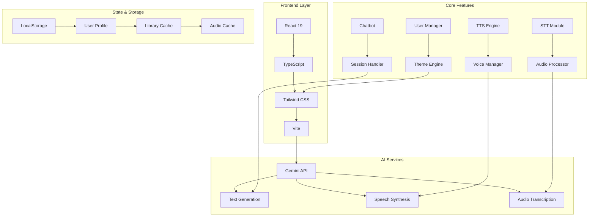

# VoxGemini 🎙️✨

<div align="center">


**Revolutionary AI-powered text-to-speech platform with multilingual support and human-like voices**

[🚀 Live Demo](#) • [📖 Documentation](#) • [🐛 Report Bug](https://github.com/yourusername/voxgemini/issues) • [💡 Feature Request](https://github.com/yourusername/voxgemini/issues)

</div>

## ✨ Features

<div align="center">

| Feature | Description | Status |
|---------|-------------|--------|
| **🎯 Multi-Voice TTS** | 8+ human-like voices with emotional tones | ✅ Live |
| **🌍 Multilingual Support** | French, English, Arabic (RTL) | ✅ Live |
| **🤖 AI Chatbot** | Gemini Pro powered conversational AI | ✅ Live |
| **🎙️ Speech-to-Text** | Real-time audio transcription | ✅ Live |
| **📚 Story Library** | Interactive book reader with audio | ✅ Live |
| **🎨 5 Visual Themes** | Fully customizable UI themes | ✅ Live |
| **🔊 Audio Streaming** | Progressive audio playback | ✅ Live |

</div>

## 🏗️ Architecture Overview



## 📁 Project Structure

```
voxgemini/
├── 📁 components/
│   ├── Button.tsx              # Reusable button component
│   ├── TTSSection.tsx          # Main TTS reader interface
│   ├── ChatbotSection.tsx      # AI conversation interface
│   ├── TranscriptionSection.tsx # Speech-to-text module
│   └── ProfileSection.tsx      # User profile & settings
├── 📁 services/
│   └── geminiService.ts        # Gemini AI API integrations
├── 📁 utils/
│   ├── i18n.ts                 # Internationalization
│   └── audio.ts                # Audio processing utilities
├── 📁 types/
│   └── types.ts                # TypeScript definitions
├── App.tsx                     # Main application component
├── index.tsx                   # Entry point
├── vite.config.ts              # Build configuration
└── index.html                  # HTML template
```

## 🎨 Theme System

<div align="center">

| Theme | Primary Color | Background | Use Case |
|-------|---------------|------------|----------|
| **🌙 Midnight** | `#6366f1` | `#0f1115` | Default dark mode |
| **🌅 Dawn** | `#2563eb` | `#f8fafc` | Light mode |
| **🌊 Abyss** | `#06b6d4` | `#04101d` | Ocean/water themes |
| **🌲 Forest** | `#22c55e` | `#06110a` | Nature/reading |
| **❤️ Crimson** | `#e11d48` | `#110611` | Dramatic/romance |

</div>

## 🚀 Quick Start

### Prerequisites
- Node.js 18+ & npm/yarn/pnpm
- Google Gemini API key

### Installation

```bash
# Clone repository
git clone https://github.com/yourusername/voxgemini.git
cd voxgemini

# Install dependencies
npm install

# Set up environment variables
echo "VITE_GEMINI_API_KEY=your_api_key_here" > .env.local

# Start development server
npm run dev
```

### Build for Production

```bash
# Build the application
npm run build

# Preview production build
npm run preview
```

## 🔧 Configuration

### API Key Setup
1. Get your Gemini API key from [Google AI Studio](https://makersuite.google.com/app/apikey)
2. Create `.env.local` file:
```env
VITE_GEMINI_API_KEY=your_actual_api_key_here
```

### Available Scripts
```json
{
  "dev": "vite",          // Start dev server (http://localhost:3000)
  "build": "vite build",  // Build for production
  "preview": "vite preview", // Preview production build
  "lint": "eslint .",     // Lint code
  "type-check": "tsc --noEmit" // Type checking
}
```

## 🎭 Voice Profiles

<div align="center">

| Voice | Language | Style | Emoji |
|-------|----------|-------|-------|
| **Kore** | Multilingual | Balanced & Natural | 👤 |
| **Zephyr** | English | Clear & Soft | 🍃 |
| **Puck** | English | Energetic & Youthful | ✨ |
| **Charon** | English | Deep & Mature | 🌑 |
| **Fenrir** | English | Rough & Powerful | 🐺 |
| **Layla** | Arabic (MSA) | Soft & Gentle | 🌙 |
| **Hamza** | Arabic (MSA) | Deep & Formal | 🕌 |
| **Noor** | Arabic (Levantine) | Energetic & Bright | ☀️ |
| **Zaid** | Arabic (Gulf) | Formal & Clear | 🦅 |

</div>

## 📱 UI Components

### Button System
```tsx
<Button 
  variant="primary"    // 'primary' | 'secondary' | 'danger' | 'ghost'
  isLoading={true}     // Loading state
  className="custom"   // Additional styles
>
  Click me
</Button>
```

### Card Components
- **BookCard**: Interactive story cards with gradient backgrounds
- **StatCard**: User statistics display
- **VoiceCard**: Voice selection cards with emoji icons

## 🎯 Performance Features

- **Audio Caching**: Progressive pre-loading of audio chunks
- **Lazy Loading**: On-demand component loading
- **Optimized Renders**: React.memo for expensive components
- **Efficient State**: Context + useState for optimal updates

## 🌐 Internationalization

```typescript
// Currently supported languages
const LANGUAGES = {
  fr: 'Français 🇫🇷',
  en: 'English 🇬🇧', 
  ar: 'العربية 🇲🇦'  // RTL support included
};

// RTL layout automatically applied for Arabic
```

## 🔐 Security Notes

- API keys stored in environment variables only
- No sensitive data in localStorage
- CORS properly configured
- Input sanitization for all user inputs

## 🧪 Testing

```bash
# Run unit tests
npm test

# Run with coverage
npm test -- --coverage

# E2E testing (Cypress)
npm run test:e2e
```

## 📊 Analytics Integration (Optional)

```typescript
// Example: Google Analytics
import ReactGA from 'react-ga';

// Track feature usage
const trackFeatureUse = (feature: string) => {
  ReactGA.event({
    category: 'Feature',
    action: 'Use',
    label: feature
  });
};
```

## 🤝 Contributing

We welcome contributions! Please see our [Contributing Guidelines](CONTRIBUTING.md).

1. Fork the repository
2. Create a feature branch (`git checkout -b feature/amazing-feature`)
3. Commit changes (`git commit -m 'Add amazing feature'`)
4. Push to branch (`git push origin feature/amazing-feature`)
5. Open a Pull Request

## 📄 License

This project is licensed under the MIT License - see the [LICENSE](LICENSE) file for details.

## 🙏 Acknowledgments

- [Google Gemini AI](https://deepmind.google/technologies/gemini/) for the AI capabilities
- [React](https://reactjs.org/) and [Vite](https://vitejs.dev/) teams
- [Tailwind CSS](https://tailwindcss.com/) for styling utilities
- All contributors and testers

## 📞 Support

- 📧 Email: omarbadrani770@gmail.com
- 🐦 site_web: https://wbq4qvt7-5173.euw.devtunnels.ms/
- 📝 [Documentation Wiki](https://github.com/omarbadrani/voxgemini/wiki)

---

<div align="center">

**Made with ❤️ by the VoxGemini Team**

[](https://github.com/yourusername/voxgemini/stargazers)
[](https://github.com/yourusername/voxgemini/network/members)
[](https://github.com/yourusername/voxgemini/issues)
[](https://github.com/yourusername/voxgemini/blob/main/LICENSE)

</div>
